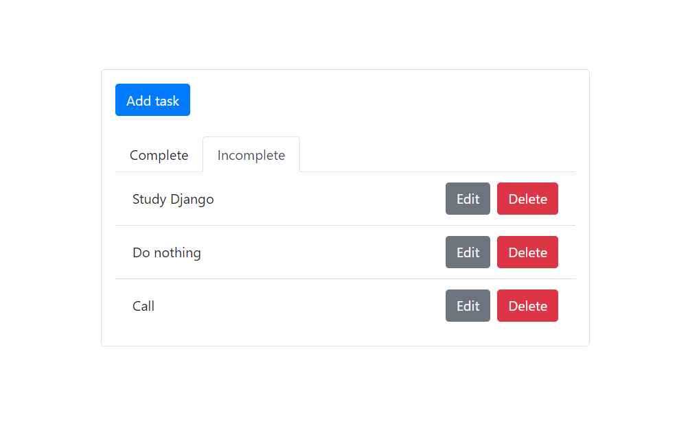

# TodoApp
Creating a Todo application using Django and React

## Description
Building a Todo Application using Django-rest-framework and react.JS. This application will allow users to create tasks and mark them as complete or incomplete. Users can edit the tasks and also remove them.

## Libraries used
```
djangorestframework
django-cors-headers
axios
bootstrap
reactstrap
```

## Reference
[Digital Ocean](https://www.digitalocean.com/community/tutorials/build-a-to-do-application-using-django-and-react)

## Images

